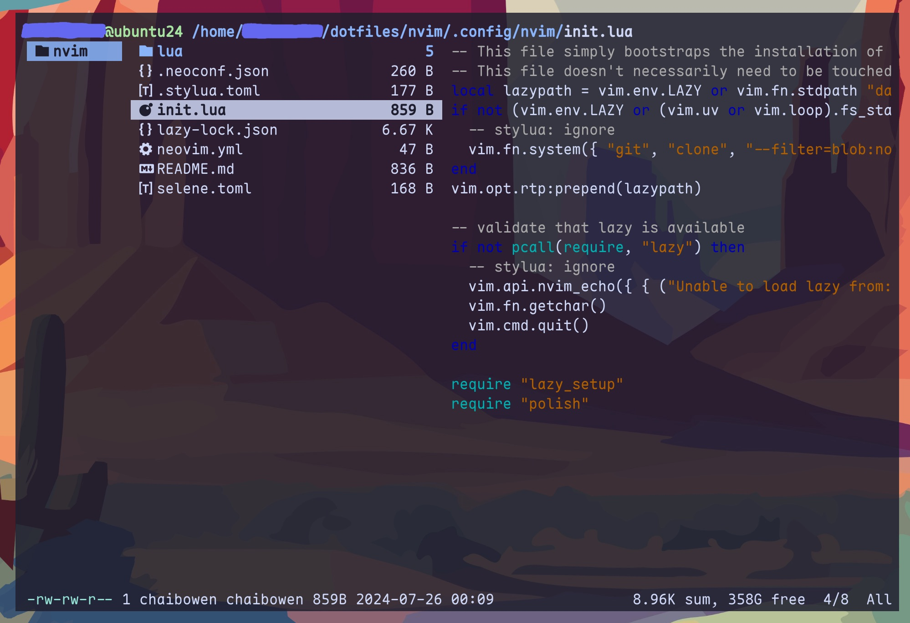

# Dotfiles
## Intro
This is my dotfiles managed by stow, including the configuration of nvim, ranger, wezterm.

## Preview




## Installation
If you want to use my configuration, you can clone my repository and use GNU stow to manage it.

```sh
cd ~/dotfiles
stow nvim
stow wezterm
stow ranger
```

Or you can place the configuration file in the correct location by yourself.

## Neovim
My Neovim configuration is based on [AstroNvim](https://github.com/AstroNvim/AstroNvim), with some of my own shortcuts, plugins, and settings.

Quick staring by `<Leader>` (`Space`), [which-key](https://github.com/folke/which-key.nvim) will show available keybindings in a popup. `<Leader>fk` is a good way to search keybindings.

Some plugins (not included in AstroNvim):
- [CopilotChat.nvim](https://github.com/CopilotC-Nvim/CopilotChat.nvim) Chat with Github Copilot. Quick with `<Leader>aa`. (This plugin requires some operations for qualification verification.)
- [project.nvim](https://github.com/ahmedkhalf/project.nvim) Quickly navigate to the target project directory. Using `<Leader>fp` to find a project, `Ctrl+w` to change CWD to target project, `:AddPoject` to add a project.
- [nvim-conda](https://github.com/kmontocam/nvim-conda) To change conda environment in nvim. `:CondaActivate`
- [flash.nvim](https://github.com/folke/flash.nvim) Navigate code with search labels. Using `s` in normal mode to search.
- [markdown](https://github.com/iamcco/markdown-preview.nvim) Markdown preview for nvim. Using `:MarkdownPreview` to start.
- [lazygit.nvim](https://github.com/kdheepak/lazygit.nvim) Call lazygit within neovim. `<Leader>gg`

I suggest to remap the `CAPS LOCK` key to `Ctrl` and `ESC` for better use of Neovim. You can refer to [this](https://gist.github.com/tanyuan/55bca522bf50363ae4573d4bdcf06e2e)

## Wezterm
My wezterm shortcuts follow the tmux style, with the leader key set to `Ctrl` + `Space`.

Some useful shortcut keys:
- `Leader + c` Create new tab
- `Leader + p` Navigate to previous tab
- `Leader + n` Navigate to next tab
- `Leader + ,` Rename tab
- `Leader + \` Horizontally split
- `Leader + -` Vertically split
- `Ctrl + Enter` Toggle full screen
- `Ctrl + d` Quit

(Ubuntu24.04 currently does not support windows with only resizable borders and no title bar. In order to enhance the aesthetics, I sacrificed the resizable border. You can use `Win + LeftMouse` to move the window. More [information](https://wezfurlong.org/wezterm/config/lua/config/window_decorations.html?h=window+decora) about this.)

I don't know why the system proxy doesn't take effect on wezterm by default. Add the following two shell functions to `.bashrc` or `.zshrc` to use proxy in wezterm.
```sh
# Function to set the proxy
proxy_on() {
    export http_proxy="http://127.0.0.1:7897/" # Replace with your own proxy.
    export https_proxy="http://127.0.0.1:7897/" # Replace with your own proxy.
    echo "Proxy environment variable set."
}
# Function to unset the proxy
proxy_off() {
    unset http_proxy
    unset https_proxy
    echo "Proxy environment variable unset."
}
```
